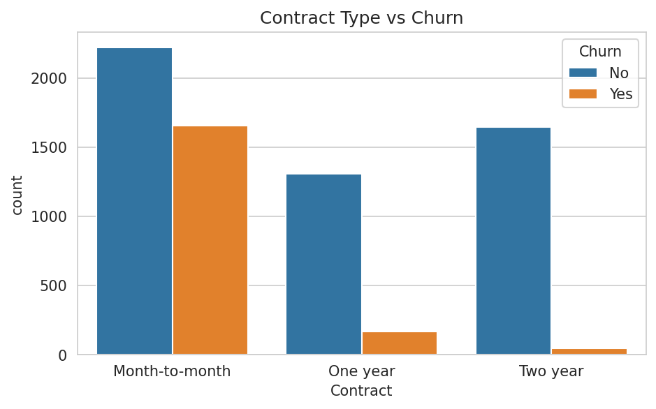
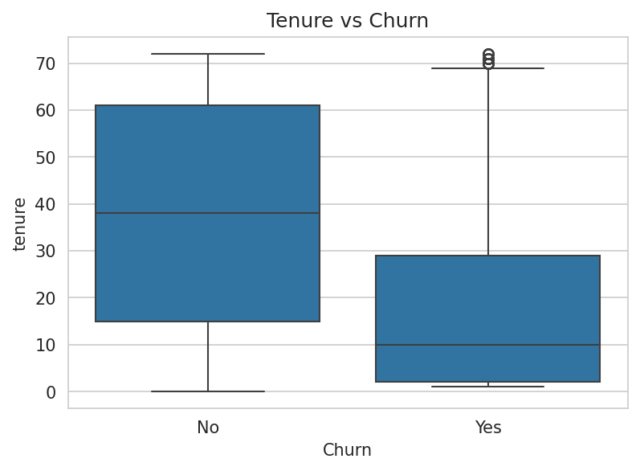
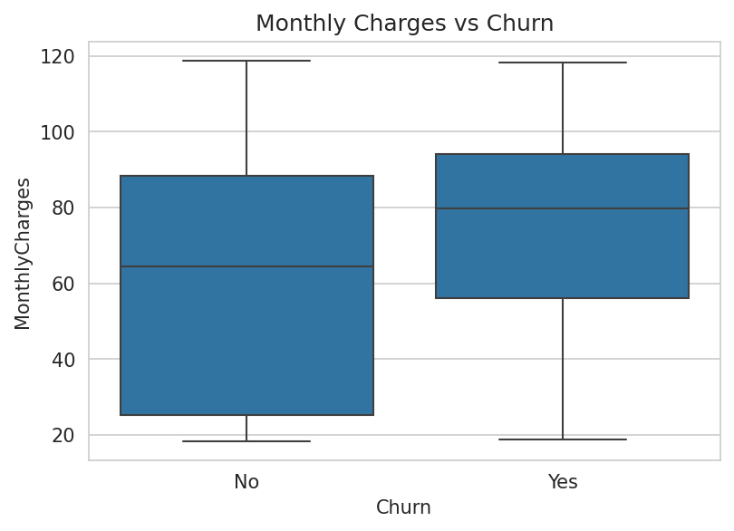
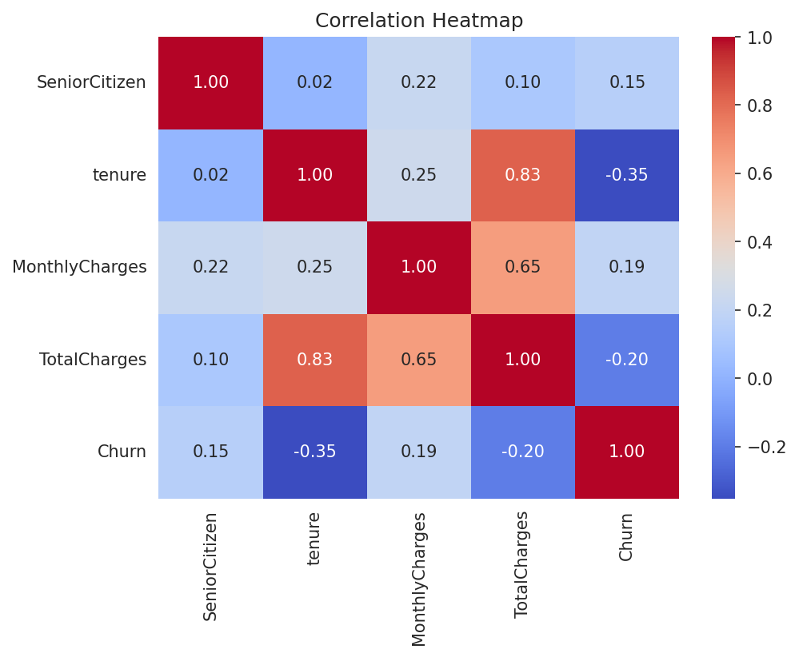
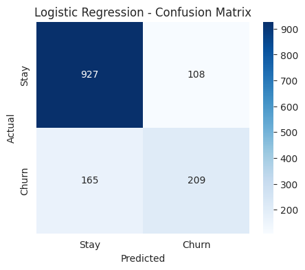
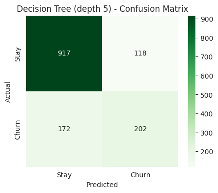
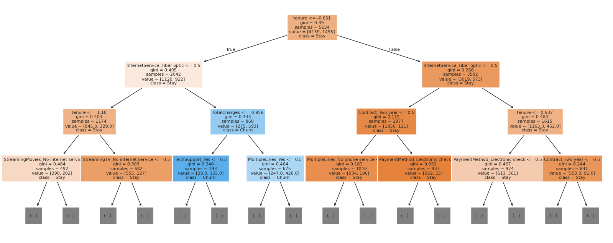

# Customer Churn Prediction

A machine learning project that predicts which telecom customers are likely to leave, built with Python and scikit-learn.

**Tools:** Python, pandas, NumPy, Matplotlib, Seaborn, scikit-learn, Google Colab

---

## Problem Statement

Keeping an existing customer is usually cheaper than acquiring a new one, but retention offers cost money and cannot go to everyone. The goal is to answer one question:

> Given a customer's profile, contract, and billing behavior, will they churn (leave) or stay?

This is a **binary classification** problem. The target is `Churn` (Yes/No).

## Dataset

- **Telco Customer Churn** dataset (Kaggle), 7,043 customers and 21 columns.
- Features include tenure, contract type, internet service, payment method, monthly charges, and total charges.
- **Class imbalance:** about 26.5% of customers churned and 73.5% stayed. A model that always predicts "Stay" would already score about 73.5% accuracy, so accuracy alone is not a reliable measure here.

## Approach

1. **Data cleaning**
   - `TotalCharges` was stored as text because 11 rows contained blank strings. These were new customers with `tenure = 0`, so they were converted to numeric and filled with 0.
   - Dropped the `customerID` column (identifier, no predictive value).
   - Checked for duplicates (none found).
2. **Exploratory data analysis:** churn distribution, contract type, monthly charges, tenure, and a correlation heatmap.
3. **Preprocessing**
   - Label encoding for two-value columns, one-hot encoding for multi-category columns.
   - Stratified 80/20 train/test split (churn ratio preserved in both sets).
   - `StandardScaler` on `tenure`, `MonthlyCharges`, and `TotalCharges`, fitted on the training set only to avoid data leakage.
4. **Modeling:** Logistic Regression and Decision Tree (unrestricted and depth-limited).
5. **Evaluation:** accuracy, precision, recall, F1, and confusion matrix, with a focus on the churn class.

## Key EDA Findings

1. **Contract type is the strongest pattern.** Month-to-month customers churn at 42.7%, versus 11.3% for one-year and 2.8% for two-year contracts.
2. **Churn is concentrated among new customers.** The median tenure of churners is about 10 months, compared to about 38 months for customers who stayed.
3. **Churners pay more per month** (median about 80 versus about 64).
4. **Tenure has the strongest correlation with churn (-0.35).** Tenure and TotalCharges are highly correlated with each other (0.83).






## Model Results

Precision, recall, and F1 are for the churn class. Evaluated on the held-out test set (1,409 customers, 374 of whom churned).

| Model | Accuracy | Precision | Recall | F1 |
|---|---|---|---|---|
| **Logistic Regression** | **0.806** | **0.659** | **0.559** | **0.605** |
| Decision Tree (unrestricted) | 0.731 | 0.493 | 0.473 | 0.483 |
| Decision Tree (max_depth=5) | 0.794 | 0.631 | 0.540 | 0.582 |

**Overfitting check:** the unrestricted Decision Tree scored 99.8% accuracy on training data but only 73.1% on test data, so it memorized the training set. Limiting the depth to 5 closed the gap (80.2% train, 79.4% test).

**Confusion matrices (test set):**

| Model | True Negative | False Positive | False Negative | True Positive |
|---|---|---|---|---|
| Logistic Regression | 927 | 108 | 165 | 209 |
| Decision Tree (depth 5) | 917 | 118 | 172 | 202 |





## What Drives Churn

From the Logistic Regression coefficients and the Decision Tree splits, the same factors appear at the top:

- **Reduce churn:** two-year contract, one-year contract, longer tenure.
- **Increase churn:** fiber optic internet service, electronic check payment, streaming TV, paperless billing.
- In the Decision Tree, customers with short tenure and fiber optic service form the highest-risk group (about 68% churned in the training data at that node).

Note: `tenure`, `MonthlyCharges`, and `TotalCharges` are correlated, so their individual coefficients should be interpreted with caution.

## Conclusion

Logistic Regression performed best on all four metrics and is also easy to explain through its coefficients, so it is the selected model. The depth-5 Decision Tree is close behind (within about 1 to 2 points), and with a single train/test split that difference should not be over-interpreted.

The main weakness of both models is **recall**: Logistic Regression catches only about 56% of actual churners, missing 165 of 374.

## Business Recommendations

- Focus retention efforts on **month-to-month** customers, for example by offering incentives to move to longer contracts.
- Invest in **onboarding and early-life support**, since the first year is the highest-risk period.
- Investigate why **fiber optic** customers churn more (price, service quality, or competition) before acting on it.
- Review the **electronic check** payment experience, since it is associated with higher churn.

These are patterns found in the data, not proven causes.

## Limitations and Next Steps

- Default classification threshold of 0.5 was used. Lowering it would catch more churners at the cost of more false alarms.
- Only one train/test split was used. Cross-validation would give a more reliable estimate.
- The Decision Tree depth was chosen as a reasonable value, not tuned. `GridSearchCV` would tune it properly.
- Try `class_weight="balanced"`, Random Forest, and Gradient Boosting to improve recall.

## Repository Structure

```
Customer-Churn-Prediction/
├── data/
│   └── Telco-Customer-Churn.csv
├── notebooks/
│   └── churn_prediction.ipynb
├── images/
│   ├── churn_distribution.png
│   ├── contract_vs_churn.png
│   ├── monthly_charges_vs_churn.png
│   ├── tenure_vs_churn.png
│   ├── heatmap.png
│   ├── confusion_matrix_logistic.png
│   ├── confusion_matrix_tree.png
│   └── decision_tree.png
├── README.md
└── requirements.txt
```

## How to Run

1. Clone the repository.
2. Install dependencies: `pip install -r requirements.txt`
3. Open `notebooks/churn_prediction.ipynb` in Jupyter or Google Colab.
4. Make sure the CSV path in the notebook points to `data/Telco-Customer-Churn.csv`, then run all cells.

## Author

[Name] (Aafiya Mariam M) | [GitHub] (https://github.com/aafiyamariam)
